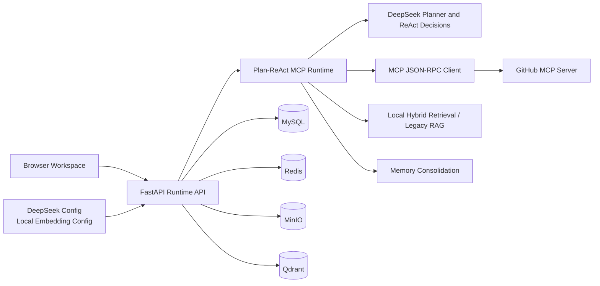
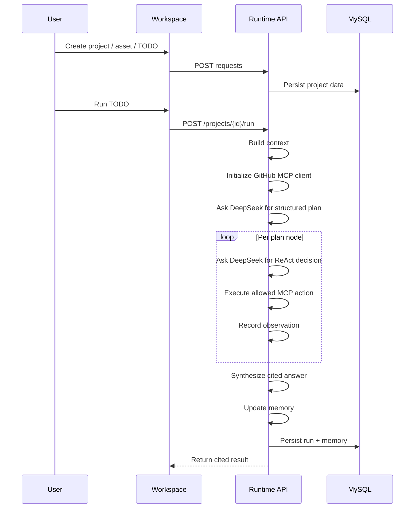

# System Architecture

## Overview

The current system uses a single FastAPI service to host both the frontend
workspace and the backend runtime. The default runtime follows a
`plan_react_mcp` flow and persists project state in MySQL.

## Backend Layers

- `main.py`: HTTP routes, lifespan startup, static frontend mount
- `services.py`: project CRUD, TODO workflow, Plan-ReAct MCP orchestration, retrieval, memory
- `mcp_client.py`: hand-written JSON-RPC MCP client over stdio, plus a Streamable HTTP skeleton
- `db_models.py`: SQLAlchemy persistence model
- `models.py`: request and response schemas
- `static/`: browser workspace UI

## Runtime Flow

## Notes

- Default `/run` and `/run/stream` require DeepSeek credentials and GitHub MCP credentials.
- Local retrieval still uses open-source local components and project asset text, mainly for legacy RAG paths and local project tools.
- The current frontend is backend-served to keep the deployment simple and reliable.
- The local Docker Compose profile mounts `/var/run/docker.sock` so the runtime can launch the GitHub MCP server container; this is a high-privilege development setting.
