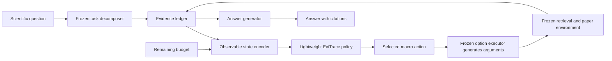

# EviTrace-RL：面向科研文献 Agent 的证据信用分配与预算约束强化学习

> 完整研究方案（独立科研路线）
> 版本：v1.0
> 日期：2026-07-19
> 预计周期：8 周
> 目标产物：可复现实验代码、公开数据处理流水线、技术报告或 arXiv 预印本、演示系统

## 0. 方案边界

本方案从纯科研问题出发，不继承 Research Copilot 当前已有的执行循环、记忆结构、工具配置、训练数据或对齐方案，也不以现有实现作为实验基线。实验环境、策略、状态、动作、奖励和评测流水线均独立设计。

Research Copilot 只承担后续故事连接：如果研究结论成立，可以在未来把本文提出的控制策略作为科研工作台的可选能力，用于改善证据获取、资源分配和停止决策。该连接不是本研究成立的前提，也不参与主要实验。

---

## 1. 一页摘要

### 1.1 核心问题

科研文献 Agent 通常需要经过多轮“搜索—阅读—验证—综合”才能回答问题。现有方法要么依赖固定工具预算，要么让大语言模型自行判断何时停止，要么直接对整个语言模型做高成本端到端强化学习。它们共同面临三个困难：

1. **终局奖励稀疏**：最终答案错误时，很难判断是哪一次检索、阅读或停止决策造成了失败。
2. **证据与答案脱节**：找到正确答案不等于形成完整、可核验的证据链，Agent 可能通过捷径猜对答案。
3. **质量—成本不可控**：固定轮数会在简单任务上浪费调用，在困难任务上又过早停止。

### 1.2 拟研究方法

提出 **EviTrace-RL**：冻结负责生成查询、阅读论文和撰写答案的 worker LLM，只训练一个轻量、可迁移的宏观控制策略。控制器根据当前证据状态和剩余预算，在以下动作间决策：

- `SEARCH_NEW`：用新查询搜索尚未见过的证据候选（论文或段落）；
- `READ_DEEP`：深入阅读已有候选文献；
- `VERIFY_CLAIM`：为未充分支持的结论寻找独立证据；
- `SYNTHESIZE`：更新结构化证据账本与阶段性结论；
- `STOP`：结束研究并生成答案。

训练时利用公开数据中的答案和证据标注构造**证据进展奖励**，并用预算条件离线强化学习学习策略；部署时不需要金标准证据，也不需要继续训练主 LLM。

### 1.3 主要研究假设

- 在相同工具预算下，证据进展奖励比纯终局奖励产生更高的答案质量与证据召回率。
- 在答案质量不劣于最佳非 RL 基线的前提下，预算条件策略能减少至少 15% 的无效工具调用。
- 在一个 worker LLM 上训练的外部控制器可以迁移到另一个 worker LLM，而无需重新训练主模型。
- 在 QASPER/SciFact 上学习到的策略能够迁移到 LitQA2-FullText 与 ScholarQABench。

### 1.4 两个月内的最小可发表单位

最小完整成果不是“做出一个 Deep Research 产品”，而是回答一个窄而可证伪的问题：

> **证据感知、预算条件的轻量离线 RL 控制器，能否在冻结主 LLM 的条件下，改善科研文献 Agent 的质量—成本 Pareto 前沿？**

---

## 2. 研究背景与机会

### 2.1 为什么是科研 Agent

科研问答天然要求多跳检索、长文阅读、矛盾证据识别和精确引用，适合被形式化为序列决策问题，而不是一次性文本生成问题。近期公开评测也显示，科研 Agent 的能力与可靠性之间仍有明显差距：

- [ResearchGym](https://arxiv.org/abs/2602.15112) 把真实 AI 研究任务封装为可执行环境，报告了急于结束、资源管理差、弱假设过度自信和上下文耗尽等长程失败模式。
- [FINDER/DEFT](https://arxiv.org/abs/2512.01948) 对约一千份 Deep Research 报告进行分析，指出证据整合、验证和稳健规划是主要瓶颈。
- [ResearcherBench](https://arxiv.org/abs/2507.16280) 将科研报告评测拆为专家 rubric 覆盖、引用忠实度和 groundedness，说明单一答案正确率不足以衡量科研 Agent。

### 2.2 为什么是 Agentic RL

多轮工具使用本质上是部分可观测序列决策。近期研究正在从“对最终输出打分”转向更细粒度的过程学习：

- [Turn-Level Reward Design](https://arxiv.org/abs/2505.11821) 表明 turn-level reward 能改善多轮 Agent RL 的信用分配、收敛速度与稳定性。
- [Agent Lightning](https://arxiv.org/abs/2508.03680) 展示了将 Agent 执行与 RL 训练解耦、再把轨迹分解为训练 transition 的可行性。
- [Search-R1](https://github.com/PeterGriffinJin/Search-R1) 提供了搜索与推理交错的开源端到端 RL 路线。
- [CaRR/C-GRPO](https://arxiv.org/abs/2601.06021) 说明引用感知 rubric reward 可以抑制搜索捷径和无证据推断。

### 2.3 尚未被充分回答的研究空白

现有工作常见两条路线：

1. 直接对 3B—30B 语言模型进行 PPO/GRPO，计算与工程成本较高；
2. 使用最终答案或整条轨迹的奖励，难以解释某一步对证据质量的边际贡献。

本研究不声称“首次研究预算或引用奖励”，而是检验一个更具体、目前仍缺乏充分证据的组合：

> **将主 LLM 冻结，把科学检索过程抽象为可跨模型迁移的宏观 SMDP，并使用金标准证据只在训练期计算潜势奖励，能否用很小的策略网络学习出可靠的预算自适应行为？**

正式写论文前应继续维护 related-work 表，避免在快速演化的 Agentic RL 领域做未经系统检索的“首个”声明。

---

## 3. 研究问题与可证伪假设

### RQ1：细粒度证据奖励是否优于终局奖励？

**H1**：在相同 worker、检索器与工具预算下，EviTrace-RL 的答案指标和 evidence F1 均显著高于只使用终局答案奖励的离线 RL。

**反证条件**：配对置信区间覆盖 0，或者提升只来自更多调用而不是更有效的证据动作。

### RQ2：学习策略是否优于固定预算和启发式停止？

**H2**：EviTrace-RL 在至少三个预算点上 Pareto 支配固定轮数、LLM 自停止和置信度阈值策略。

**反证条件**：最强启发式在质量—成本曲线上不弱于学习策略。

### RQ3：外部控制策略是否具有跨模型迁移性？

**H3**：在 Qwen3-4B worker 的轨迹上训练控制器后，替换为 Qwen3-1.7B 或另一开放权重 worker，策略仍保持正收益。

**反证条件**：不重新训练时收益消失，说明控制器学习的是特定模型行为指纹而非一般研究策略。

### RQ4：组件任务上的提升能否迁移到长报告？

**H4**：在 QASPER/SciFact 上训练后，控制器能提升 LitQA2-FullText 的答案准确率或检索效率，并在 ScholarQABench 上提高 citation recall/accuracy 中至少一项且不损害另一项。

**反证条件**：短答案任务收益无法迁移，或长报告的引用质量明显下降。

### RQ5：策略能否降低随机性导致的可靠性波动？

**H5**：相对于 LLM 自停止，控制器降低跨随机种子的任务级结果方差，并减少 premature stop 和重复搜索。

---

## 4. 形式化定义

### 4.1 从 POMDP 到宏观 SMDP

真实的“问题是否已经被充分回答”不可直接观测，因此将科研过程建模为 POMDP。为避免训练整个语言模型，把一次宏观研究动作视为 option，形成半马尔可夫决策过程：

$$
\mathcal{M}=\langle \mathcal{S},\mathcal{A},P,R,C,\gamma,B\rangle
$$

- \(s_t\)：当前查询、证据账本、候选文献、历史动作与剩余预算构成的状态；
- \(a_t\)：宏观动作类型；具体查询文本、文献 ID 或待验证 claim 由冻结 worker 生成；
- \(P\)：检索环境、文献读取器和 worker 共同决定的转移；
- \(R\)：答案、证据进展和行为质量奖励；
- \(C\)：token、检索、阅读和验证成本；
- \(B\)：单任务资源预算；
- \(\gamma\)：折扣因子。

优化目标为：

$$
\max_\pi \; \mathbb{E}_\pi\left[\sum_t \gamma^t r_t\right]
\quad \text{s.t.}\quad
\mathbb{E}_\pi\left[\sum_t c_t\right]\le B
$$

### 4.2 策略可见的状态特征

控制器不能看到测试集金标准答案或证据。可观测状态只包含运行时可获得的信息：

| 类别 | 特征示例 |
|---|---|
| 任务 | 问题 embedding、问题长度、估计子问题数、答案类型 |
| 检索 | 已检文献数、top-k 分数分布、来源/年份多样性 |
| 证据 | 当前 claim 数、支持/反驳边比例、最低支持置信度 |
| 进展 | 最近一步新颖度、覆盖估计增量、连续无增益步数 |
| 不确定性 | 多次短答案的一致率、答案熵、支持与反驳 margin |
| 成本 | 已用/剩余 budget、token、工具调用、累计延迟 |
| 风险 | 重复查询率、失败调用次数、单一来源依赖程度 |

文本特征使用冻结 embedding；表格特征标准化后拼接。第一版采用 64—256 维向量，不引入 GNN，以便把结果归因于信用分配而非复杂模型容量。

### 4.3 宏观动作空间

| 动作 | 行为 | 典型成本 |
|---|---|---:|
| `SEARCH_NEW` | 生成新查询并返回候选文献/段落 | 1.0 |
| `READ_DEEP` | 阅读候选论文的相关章节 | 1.5 |
| `VERIFY_CLAIM` | 对低支持结论检索独立支持或反驳证据 | 1.5 |
| `SYNTHESIZE` | 更新 claim—evidence 账本和当前答案草稿 | 1.0 |
| `STOP` | 结束轨迹并生成最终答案 | 0.2 |

表中成本是研究环境内的归一化单位；真实实验还需分别记录 token、墙钟时间与调用次数，不能只报告人工定义成本。

### 4.4 证据账本

证据账本不是长期记忆系统，而是单任务内的结构化环境状态：

```text
claim_id
claim_text
supporting_passage_ids[]
contradicting_passage_ids[]
source_ids[]
support_score
verification_status
```

worker 负责从已读内容中生成原子 claim；冻结的 NLI/科学 claim verifier 负责生成支持分数。账本只影响研究轨迹，不跨任务保存用户信息。

---

## 5. EviTrace-RL 方法

### 5.1 总体架构



核心解耦是：worker 负责语言，controller 负责资源决策。训练 controller 时冻结 worker、embedding、retriever、NLI verifier 和答案生成器。

### 5.2 证据潜势函数

公开训练数据提供金标准答案与证据段落，可以在训练期计算潜势：

$$
\Phi(s_t)=
w_c C_t + w_f F_t + w_d D_t - w_r U_t
$$

- \(C_t\)：金标准证据覆盖率；
- \(F_t\)：已收集证据对目标 claim 的支持/反驳正确性；
- \(D_t\)：已匹配有效证据中的非冗余章节/来源多样性；当数据集没有跨来源标注时令该项权重为 0；
- \(U_t\)：冗余证据、重复查询和无增益步骤比例。

过程奖励采用 potential-based shaping：

$$
r_t^{proc}=\gamma\Phi(s_{t+1})-\Phi(s_t)
$$

这种设计奖励“新增了什么”，而不是奖励证据池的绝对规模，因此可以减少通过无止境堆积文献获得高分的漏洞。金标准只用于训练奖励和离线评估，不作为策略输入。

### 5.3 终局奖励

$$
r_T =
\alpha R_{answer}
+\beta R_{evidence}
+\eta R_{citation}
-\lambda C_{total}
-\mu R_{unsupported}
$$

- 分类或选择题使用 exact match/accuracy；
- 开放答案使用官方 token F1、ROUGE-L 或 rubric score；
- evidence reward 使用 passage-level precision/recall/F1；
- citation reward 检查引用是否支持相邻 claim，以及应引用 claim 是否有引用；
- unsupported penalty 针对没有证据或证据与 claim 矛盾的断言。

主实验必须分别报告每个分量，不能只报告加权总分，以免权重选择掩盖真实退化。

### 5.4 预算条件离线 IQL

主算法选择离线 Implicit Q-Learning（IQL），原因是：

- 真实文献检索 rollout 昂贵，适合重复使用固定轨迹；
- 动作空间小而离散；
- IQL 不需要显式选择数据分布外动作，较适合混合质量日志；
- controller 很小，不需要 LLM 级训练基础设施。

把归一化预算 \(b_t=B_{remain}/B\) 拼入状态，学习单个预算条件策略。标准目标为：

$$
\mathcal{L}_V=\mathbb{E}[L_\tau(\bar Q(s,a)-V(s))]
$$

$$
\mathcal{L}_Q=\mathbb{E}[(r+\gamma V(s')-Q(s,a))^2]
$$

$$
\mathcal{L}_\pi=-\mathbb{E}[\exp(\beta(Q-V))\log \pi(a|s)]
$$

实现上使用两层 MLP；同时实现 Fitted Q Iteration、行为克隆和 LinUCB 作为低复杂度对照。若 IQL 未明显超过 LinUCB，这本身是有价值的负结果，不能通过临时扩大模型掩盖。

预算约束采用两层机制：

1. **硬约束**：环境根据剩余预算 mask 掉无法支付的动作；如果除 `STOP` 外都不可执行，则强制终止。这样不会出现策略用超预算换高奖励的情况。
2. **软权衡**：在可执行动作中仍扣除归一化成本，并将剩余预算输入策略，从而学习同一预算内如何分配搜索、阅读和验证。

成本权重只在开发集选择一次；主结果额外扫描成本权重，给出 Pareto 曲线，而不是只展示最有利的单点。

### 5.5 可选扩展：反事实边际奖励

主结果稳定后，可对每条完整轨迹做 leave-one-step-out 回放：移除第 \(t\) 个证据动作，重新计算终局证据指标，得到近似边际贡献：

$$
\Delta_t = R(\tau)-R(\tau\setminus a_t)
$$

它可以作为额外的信用分配信号，但不是八周计划的关键路径，因为重新综合答案会增加大量推理成本。

### 5.6 训练与部署伪代码

```text
# Phase A: collect public-data trajectories
for task in QASPER_train ∪ SciFact_train:
    for behavior_policy, budget, seed in rollout_schedule:
        state = env.reset(task, budget, seed)
        while not done:
            action_type = behavior_policy(state)
            action_args = frozen_worker.execute_option(action_type, state)
            next_state, cost = env.step(action_type, action_args)
            process_reward = gold_evidence_potential(next_state) - gold_evidence_potential(state)
            store(state, action_type, process_reward, cost, next_state)
            state = next_state
        attach_terminal_answer_and_evidence_reward()

# Phase B: learn only the macro controller
train_budget_conditioned_IQL(transitions)
freeze_controller_and_all_prompts()

# Phase C: evaluate without gold information
for task in held_out_benchmark:
    state = env.reset(task, budget)
    while controller.select(state) != STOP:
        execute_selected_option_with_frozen_worker()
        update_observable_evidence_ledger()
    generate_answer_and_score_with_official_evaluator()
```

实现时，potential difference 应为 \(\gamma\Phi(s_{t+1})-\Phi(s_t)\)，伪代码为可读性省略了折扣项。测试阶段的 controller 和 state encoder 均不能访问 `gold_evidence_potential`。

---

## 6. 公开数据方案

### 6.1 数据集选择原则

1. 问题、语料或可执行环境公开可获得；
2. 至少一部分数据具有答案和证据级标注；
3. 训练集与外部评测集按任务来源隔离；
4. 优先使用冻结语料，避免 live web 变化破坏可复现性；
5. 保存原始许可证、数据卡、版本号与文件哈希；
6. “仓库公开”不自动等于“其中所有论文全文可再分发”，只缓存和发布许可允许的内容。

### 6.2 数据集及用途

| 数据集 | 公开信息 | 本研究用途 | 是否用于训练 | 许可/注意事项 |
|---|---|---|---:|---|
| [QASPER](https://huggingface.co/datasets/allenai/qasper) | 5,049 个问题，覆盖 1,585 篇 NLP 论文；包含答案与证据 | 主训练环境、ID 验证、evidence reward | 是，仅官方 train | 数据卡标注 CC BY 4.0 |
| [SciFact](https://github.com/allenai/scifact) | 约 1.4K 专家科学 claim、5,183 篇摘要，含支持/反驳 rationale | verifier 训练/校准、claim 验证动作 | 是，仅 train/dev | 使用仓库发布数据并保留其 LICENSE/attribution；test 标签不公开 |
| [AstaBench LitQA2-FullText](https://allenai.org/asta/bench) | 需要定位并阅读开放全文论文的科学问题 | 主要跨领域、端到端域外测试 | 否 | 只用 Asta 标准索引的开放全文子集；遵守原始 LitQA2 条款 |
| [LitQA2/LAB-Bench](https://huggingface.co/datasets/futurehouse/lab-bench) | 公开科学文献问题，官方 PaperQA/Aviary 提供划分 | 对照 Asta 结果、复现 Aviary 环境 | 否，最终 eval/test 只运行一次 | 数据卡标注 CC BY-SA 4.0；按官方 split 使用 |
| [ScholarQABench](https://github.com/AkariAsai/ScholarQABench) | 科学检索与长文献综述评测，含 citation/rubric 脚本 | 长报告外部评测 | 否 | 仓库 MIT；发布结果时仍需核对上游语料许可 |
| [ResearcherBench](https://github.com/GAIR-NLP/ResearcherBench) | 65 个前沿 AI 科研问题、专家 rubric、citation 评测 | 最终压力测试与定性案例 | 否 | 公开仓库；正式发布前复核其许可和网页抓取条款 |

补充说明：OpenScholar 论文报告 ScholarQABench 包含 2,967 个专家问题和 208 个长答案，覆盖计算机科学、物理、神经科学和生物医学；相关数据与评测脚本已公开。[论文](https://arxiv.org/abs/2411.14199)｜[代码](https://github.com/AkariAsai/ScholarQABench)

### 6.3 明确不采用的数据做法

- 不把 DeepResearch Bench、ResearcherBench 或 ScholarQABench 测试问题改写后加入训练集；
- 不使用当前项目运行日志生成训练标签；
- 不把闭源 Deep Research 产品输出当作金标准训练数据；
- 不依赖无法冻结和再现的实时搜索结果作为主实验环境；
- 不使用许可信息为空的 130K OpenSciLM 指令数据作为关键训练数据，除非后续取得清晰的数据许可与来源说明。

### 6.4 数据切分与去污染

1. 严格保留 QASPER、SciFact 和 LitQA2 官方 split；
2. 以 DOI、Semantic Scholar Paper ID、标题规范化 hash 做跨数据集论文去重；
3. 使用 MinHash/embedding 检查问题近重复，阈值和人工复核样本公开；
4. 外部评测问题及其 rubric 不进入提示优化或超参数选择；
5. LitQA2 official test 与 ResearcherBench 只在模型冻结后运行一次；
6. 记录数据快照时间、commit SHA、SHA-256 和过滤统计；
7. 报告 worker 模型可能存在预训练污染这一不可完全排除的限制，并用“检索证据命中”而非纯答案正确率作为重要指标。

---

## 7. 离线轨迹数据构建

### 7.1 行为策略混合

只用一种行为策略会导致严重的 action support 缺失。训练轨迹由以下策略混合产生：

- 随机但受约束的宏动作策略；
- 固定预算 3/5/8/12 的策略；
- worker LLM 自行停止；
- 基于检索新颖度和答案一致率的启发式策略；
- 使用训练集金标准证据构造的弱 oracle，只占少量轨迹，用于提供高质量行为上界。

弱 oracle 只用于训练集轨迹生成，不进入测试策略，也不能把 gold passage ID 作为 policy state。

### 7.2 建议规模

- QASPER train 中抽取约 1,000—1,500 个问题，主要覆盖段落检索、深读、综合和停止；
- SciFact train 中抽取约 600—800 个 claim，主要覆盖开放摘要检索、支持/反驳验证和停止；
- 每题采样 2—3 个预算/随机种子组合；
- 首轮形成约 3,200—5,000 条轨迹、18,000—40,000 个 transition；
- 若算力不足，先完成 QASPER 800 题 + SciFact 400 claim，各 2 条轨迹；
- 若某宏动作占比低于 5%，补采定向探索轨迹，而不是简单上采样 transition。

### 7.3 Transition 格式

```json
{
  "task_id": "qasper-...",
  "step": 3,
  "state_features": [0.12, 0.87],
  "budget_total": 8.0,
  "budget_remaining": 4.5,
  "action": "VERIFY_CLAIM",
  "action_arguments": {"claim_id": "c2"},
  "observation_ids": ["paper:section:passage"],
  "process_reward": 0.31,
  "terminal_reward": 0.0,
  "cost": 1.5,
  "next_state_features": [0.18, 0.91],
  "done": false,
  "behavior_policy": "fixed_budget_8",
  "seed": 17
}
```

文本、检索结果和模型生成应单独按内容 hash 缓存，transition 只保存引用，避免重复占用存储并便于审计。

---

## 8. 实验设计

### 8.1 模型与环境控制

- 主 worker：[Qwen3-4B](https://huggingface.co/Qwen/Qwen3-4B)，Apache 2.0，冻结参数；
- 小模型迁移 worker：[Qwen3-1.7B](https://huggingface.co/Qwen/Qwen3-1.7B)，冻结参数；
- 可选第三 worker：另一个许可允许、参数规模相近的开放权重 instruct 模型；
- 检索器：固定 BM25 与一个固定 dense retriever，索引与 top-k 参数在主实验前冻结；
- verifier：在 SciFact train 训练或直接使用公开科学 claim verification checkpoint，在 SciFact dev 校准阈值；
- controller：两层 MLP，参数量预计低于 1M；
- 所有 worker 的采样参数、prompt、工具 schema、最大单步生成长度保持一致并公开。

Qwen3-4B 原生上下文为 32,768 tokens；本研究不依赖扩展上下文，强制通过证据账本控制上下文，避免把“更长上下文”混入算法收益。

### 8.2 基线

| ID | 基线 | 用途 |
|---|---|---|
| B0 | Direct answer，无检索 | 测试任务是否真的需要外部证据 |
| B1 | 固定预算 3/5/8/12 | 构建完整质量—成本曲线 |
| B2 | worker LLM 自停止 | 对比自然 Agent 行为 |
| B3 | 新颖度/置信度阈值停止 | 最强手写启发式 |
| B4 | Full budget | 质量上限与资源浪费参照 |
| B5 | Behavior cloning | 检验是否只需要模仿 |
| B6 | LinUCB contextual bandit | 检验长程价值学习是否必要 |
| B7 | IQL + terminal reward only | 隔离证据过程奖励贡献 |
| B8 | EviTrace-IQL | 完整方法 |

可选 stretch baseline：用 Qwen3-1.7B LoRA 做小规模 GRPO。但它不属于最低完成要求，不能因为端到端训练失败而拖延主实验。

### 8.3 评测矩阵

| 层级 | 数据 | 任务 | 主要回答指标 | 主要证据指标 |
|---|---|---|---|---|
| ID | QASPER dev/test | 单论文信息寻求 QA | Answer F1、Yes/No accuracy | Evidence P/R/F1 |
| Claim | SciFact dev/公开评测 | 科学 claim 验证 | Label accuracy/F1 | Rationale selection F1 |
| OOD | LitQA2-FullText | 跨论文检索与阅读 | Multiple-choice accuracy | Paper recall、调用数 |
| Long-form | ScholarQABench | 文献综述 | 官方 rubric/ROUGE 指标 | Citation correctness/recall |
| Stress | ResearcherBench | 前沿科研报告 | Weighted coverage | Faithfulness、groundedness |

ResearcherBench 评测需要网页抓取和 judge API，成本和外部变化较大，因此只作为最终 stress test，不作为训练反馈或主要显著性结论的唯一来源。

### 8.4 预注册的主要终点

为防止事后挑指标，建议在主实验前冻结以下优先级：

1. **主要终点 A**：LitQA2-FullText 在归一化预算 8 下的 accuracy；
2. **主要终点 B**：QASPER 上 \(0.5\times AnswerF1+0.5\times EvidenceF1\)；
3. **效率终点**：归一化 quality—cost AUC；
4. **安全终点**：citation correctness 不得比最强非 RL 基线下降超过 2 个百分点；
5. 其他指标均标记为 secondary/exploratory。

复合指标只用于模型选择和总体比较，论文表格必须同时展示原始 Answer F1 与 Evidence F1。

### 8.5 成本指标

每条任务至少记录：

- 检索调用数；
- 阅读文献数与段落数；
- worker input/output tokens；
- verifier 调用数；
- controller 决策时间；
- 总墙钟时间；
- 若使用 API，则记录按当日价格计算的实际费用和价格快照。

质量—成本曲线使用相同 worker、相同检索器和相同硬件测量，避免把基础设施差异误当作策略收益。

---

## 9. 统计分析

### 9.1 随机性控制

- 主方法和随机基线至少运行 3 个种子；
- 对同一任务使用配对比较；
- 固定检索索引和语料快照；
- generation seed、controller seed 和轨迹采样 seed 分开记录；
- temperature=0 的结果不能替代多种子可靠性分析。

### 9.2 显著性检验

- accuracy：McNemar 检验与 task-level paired bootstrap；
- F1、citation 和成本：10,000 次 paired bootstrap，报告 95% CI；
- 多个数据集/预算点的 secondary comparisons 使用 Benjamini–Hochberg 校正；
- 同时报告绝对提升、相对提升和效应量，不只报告 p-value；
- 对长报告 judge score 报告 judge 重复运行方差，并人工复核随机抽取的至少 50 个 claim—citation 对。

### 9.3 成功门槛

只有满足下列至少三项，才将“方法有效”写入摘要：

1. 同成本下主要质量指标比最强非 RL 基线高至少 3 个百分点，且 95% CI 不跨 0；
2. 在 non-inferiority margin 为 1 个百分点时，平均成本降低至少 15%；
3. 在两个 worker backbone 上均取得正迁移收益；
4. citation correctness 不下降超过 2 个百分点；
5. premature stop 或重复调用率至少一项显著下降。

如果只在 QASPER 上有效而在 LitQA2/ScholarQA 上无效，应把结论限制为“单论文证据选择”，不能包装成通用科研 Agent 改进。

---

## 10. 消融与诊断实验

### 10.1 奖励消融

- 去掉 evidence coverage；
- 去掉 support/contradiction correctness；
- 去掉 diversity；
- 去掉 redundancy penalty；
- 去掉成本项；
- 只保留 terminal reward；
- potential difference 与直接绝对 potential 对比。

### 10.2 状态消融

- 不提供 remaining budget；
- 不提供不确定性；
- 不提供证据账本特征；
- 只使用成本与轮数；
- 文本 embedding 替换为纯统计特征。

### 10.3 学习算法消融

- behavior cloning；
- LinUCB；
- Fitted Q Iteration；
- IQL；
- 可选 CQL。

### 10.4 泛化实验

- Qwen3-4B → Qwen3-1.7B；
- NLP 论文 QASPER → 生物/综合科学 LitQA2；
- 短答案 → ScholarQA 长报告；
- BM25 → dense retriever；
- budget 训练区间内插与区间外外推。

### 10.5 失败类型

人工分析至少 100 个失败任务，使用预先定义的 taxonomy：

- premature stop；
- late stop / redundant search；
- query drift；
- missed evidence；
- false support；
- unresolved contradiction；
- source monoculture；
- correct evidence, wrong synthesis；
- correct answer, unsupported reasoning；
- tool/runtime failure。

每类报告频率、代表案例和相对于基线的变化，避免只挑成功案例。

---

## 11. 可复现性与开放科学

建议独立研究代码采用如下结构，后续是否并入产品仓库由研究完成后决定：

```text
evitrace_rl/
├── configs/
│   ├── datasets/
│   ├── workers/
│   └── experiments/
├── data_manifests/
│   ├── DATASET_CARD.md
│   ├── LICENSES.md
│   └── checksums.json
├── envs/
│   ├── qasper_env.py
│   ├── scifact_env.py
│   └── litqa_env.py
├── policies/
│   ├── heuristics.py
│   ├── linucb.py
│   ├── fqi.py
│   └── iql.py
├── rewards/
│   ├── evidence_potential.py
│   └── terminal_reward.py
├── rollout/
├── evaluation/
├── tests/
└── reports/
```

必须公开或记录：

- 环境与依赖 lockfile；
- 数据下载脚本、版本与 hash，不直接重新分发受限论文；
- 所有 prompt、tool schema、模型 revision；
- 轨迹 JSON schema 与缓存生成方式；
- 每个表格和图片的一键重现命令；
- 失败运行和被排除样本及原因；
- API judge 的模型版本、日期与原始响应；
- 至少一个完全不依赖付费 API 的核心复现实验路径。

---

## 12. 算力与成本规划

### 12.1 最低配置

- 1 张 24GB 显存 GPU；
- Qwen3-4B 量化推理或较短上下文 BF16/FP16 推理；
- 32GB—64GB RAM；
- 500GB—1TB SSD，用于开放论文、索引、轨迹和缓存；
- controller 训练本身可在 CPU 或单卡完成。

实际显存取决于推理框架、KV cache、batch 和上下文长度，正式执行前用 50 条任务做峰值显存与吞吐 profiling，不在方案中承诺未经测量的速度。

### 12.2 建议预算档位

| 档位 | Rollout 数 | 预估用途 | 风险 |
|---|---:|---|---|
| Minimum | 1,600—2,000 | 证明 QASPER 主结果和 LitQA2 小规模迁移 | 消融统计功效较弱 |
| Recommended | 3,000—4,500 | 完成主要基线、3 seeds 和主要消融 | 单卡采集时间较长 |
| Stretch | 6,000+ | 跨模型、反事实奖励和更多长报告 | 可能超出 8 周关键路径 |

开发阶段使用本地开放模型和规则/NLI evaluator；付费 judge 只在最终冻结版本运行。设定硬成本上限，达到上限后优先减少 ResearcherBench/长报告样本，而不是减少主要公开 benchmark 的统计完整性。

---

## 13. 八周执行计划

### 第 1 周：问题冻结与数据复现

- 建立独立研究目录和环境；
- 下载 QASPER、SciFact、LitQA2/AstaBench；
- 固化数据版本、许可和 hash；
- 跑通官方 QASPER/SciFact evaluator；
- 完成 50 条任务的 worker 与检索吞吐 profiling。

**Gate W1**：公开数据可下载、官方指标可重现、无许可或全文访问阻塞。

### 第 2 周：SMDP 环境与基线

- 实现五个宏动作和证据账本；
- 完成固定预算、LLM 自停止、阈值启发式；
- 验证状态不包含 gold 泄漏；
- 对 100 个任务人工检查 transition。

**Gate W2**：环境 deterministic replay 一致率 100%，至少三种基线可运行。

### 第 3 周：奖励与轨迹采集

- 实现 evidence potential 和 terminal reward；
- 在训练集上验证奖励方向；
- 开始混合行为策略 rollout；
- 监控动作覆盖与无效轨迹比例。

**Gate W3**：奖励与人工判断在 100 个步骤上的 Spearman 相关为正；每个动作支持率达到可训练水平。

### 第 4 周：离线 RL

- 实现 BC、LinUCB、FQI、IQL；
- 完成超参数选择和 offline policy evaluation sanity check；
- 冻结主方法配置。

**Gate W4**：IQL 至少超过 behavior cloning；若没有，先诊断数据 support 和 reward，而不是扩大网络。

### 第 5 周：ID 主实验

- QASPER 与 SciFact 主结果；
- 预算 3/5/8/12 曲线；
- 3 seeds、bootstrap CI；
- 完成第一版失败 taxonomy。

**Gate W5**：主要终点至少一个达到预设效应门槛，否则触发收缩方案 A。

### 第 6 周：OOD 与长报告

- LitQA2-FullText 最终迁移；
- ScholarQABench 选定公开子集；
- 跨 worker 实验；
- 最终冻结后运行一次外部测试。

**Gate W6**：至少一个 OOD 数据集保持正收益且 citation 指标不恶化。

### 第 7 周：消融、统计与人工审计

- 奖励/状态/算法消融；
- 100 个失败案例分析；
- 人工复核至少 50 个 claim—citation 对；
- 输出主表、Pareto 曲线、可靠性图。

### 第 8 周：写作与交付

- 完成 6—8 页英文论文式技术报告或中文完整报告；
- 清理代码、README、数据卡与许可证；
- 录制 3—5 分钟可视化演示；
- 形成简历 bullet、项目主页和未来集成说明。

---

## 14. 风险、止损与收缩方案

### 风险 1：离线 RL 不超过简单启发式

可能原因是状态近似充分、决策短程，contextual bandit 已足够。不要强行包装 IQL 优势；将结论改为：

> 科研检索宏观控制何时需要长程 RL，何时简单 bandit 已足够。

这仍可形成扎实的对照研究。

### 风险 2：reward hacking

策略可能通过堆积短、重复证据提高覆盖分。缓解：

- 使用 potential difference 而非绝对数量；
- 对同源、近重复段落去重；
- 单独报告答案、evidence 和 citation 指标；
- 人工审计高奖励异常轨迹。

### 风险 3：verifier 噪声污染状态

- 在 SciFact dev 上校准；
- 人工抽样评估 precision/recall；
- 做 verifier 噪声注入消融；
- 不让 verifier 同时作为唯一训练奖励和唯一最终 evaluator。

### 风险 4：短 QA 无法代表长科研报告

主结论限制为“scientific literature agent”，而非“AI scientist”；ScholarQABench 和 ResearcherBench 仅验证外推，不用个别成功案例扩大结论。

### 风险 5：公开问题但全文不开放

优先使用 AstaBench LitQA2-FullText 开放全文子集；只发布 DOI/ID、下载脚本和 hash，不重新分发无权分发的 PDF。

### 风险 6：两个月 rollout 不足

按以下顺序缩减：

1. 取消反事实 leave-one-out；
2. 缩减 ResearcherBench；
3. 取消端到端 GRPO stretch；
4. 保留 QASPER + LitQA2 + 完整基线/消融；
5. 不削减数据隔离、统计检验和引用审计。

### 风险 7：金标准证据并不完备

QASPER/SciFact 的 evidence annotation 可能只覆盖标注者找到的证据，而不是所有有效证据。如果把未标注段落一律判错，过程奖励会惩罚合理探索。缓解：

- gold evidence 命中提供强正奖励，但未命中不自动提供同等强度的负奖励；
- 对高 NLI 支持、但未在 gold 中出现的段落标记为 `plausible alternative`；
- 随机人工复核至少 100 个高支持非 gold 段落；
- 分别报告严格 gold evidence 指标与 verifier-assisted 指标；
- 在 reward ablation 中去掉非 gold penalty，检查结论是否依赖不完整标注。

### 收缩方案 A：最稳妥最小论文

只研究 QASPER → LitQA2 的预算条件证据检索，动作缩为 `SEARCH/READ/VERIFY/STOP`，比较 threshold、LinUCB、FQI、IQL。仍然保留跨域迁移、Pareto 曲线和证据奖励。

### 收缩方案 B：负结果转化

若学习控制器完全无收益，发布系统性诊断：固定预算、LLM 自停止、bandit 和 offline RL 在科研检索上的适用边界，以及 premature/late stopping 数据集。不能把负结果改写成不存在的提升。

---

## 15. 预期贡献

若假设成立，可以主张以下有限而清晰的贡献：

1. 将科研文献检索抽象为与 worker LLM 解耦的预算条件宏观 SMDP；
2. 提出基于金标准证据边际进展的 potential-based process reward；
3. 用轻量离线 RL 学习跨预算、跨 worker 的研究控制策略，无需微调主 LLM；
4. 在公开科学 QA、开放全文检索和长报告 benchmark 上评测质量、证据、成本与可靠性；
5. 发布可重放轨迹格式、失败 taxonomy 与完全公开的核心实验路径。

不能主张：

- “实现了自动科学发现”；
- “解决了科研幻觉”；
- “首次将 RL 用于科研 Agent”；
- “通用于所有 Agent”；
- 只凭 LLM judge 分数声称超过人类研究者。

---

## 16. 与 Research Copilot 的后续故事连接

研究阶段完全独立。只有在公开 benchmark 上验证后，才把成果作为 Research Copilot 的后续规划：

1. 产品系统负责提供论文搜索、文档阅读和报告生成工具；
2. EviTrace controller 作为可插拔高层策略，决定工具类型和预算分配；
3. 执行 trace 转换为标准 transition，用于离线评估而不是直接在线训练用户数据；
4. UI 展示“为什么继续搜索/为什么停止”、剩余预算和证据覆盖；
5. 默认保持只读研究行为，涉及外部副作用时不由 RL 策略自动执行。

推荐叙事：

> 在完成科研工作台的工程原型后，我们进一步从独立科研问题出发，研究科研 Agent 在有限预算下的证据获取与停止决策。我们没有继续堆叠 prompt 或微调大模型，而是将研究过程形式化为宏观 SMDP，利用公开科学数据中的证据标注训练可跨模型迁移的轻量离线 RL 控制器；验证成立后，再计划将其作为工作台的可插拔策略层。

---

## 17. 简历与面试材料模板

结果出来前不要填写虚构数字。完成后可使用：

> **EviTrace-RL — Budgeted Scientific Research Agent**
> 针对科研文献 Agent 终局奖励稀疏、证据链不完整和固定预算低效的问题，将搜索—阅读—验证过程建模为预算条件 SMDP，设计基于 gold evidence 边际增益的 potential-based step reward，并训练冻结主 LLM 的轻量离线 IQL 控制器。在 QASPER、LitQA2-FullText 与 ScholarQABench 上，相较最强非 RL 基线将 `<主要质量指标>` 提升 `<X>`，在 non-inferior quality 下减少 `<Y>` 工具成本，并完成跨 worker/跨领域迁移和 citation 人工审计。

面试重点应能回答：

- 为什么这是 RL，而不是分类器或 prompt routing？
- 为什么选 IQL，为什么必须有 LinUCB/BC 对照？
- gold evidence 是否泄漏到 policy state？
- potential reward 会不会改变最优策略或被 reward hacking？
- 如何证明收益不是更多检索、更强 worker 或更长上下文带来的？
- 外部 benchmark 为什么不参与调参？
- 如果 RL 不优于启发式，研究结论是什么？

---

## 18. 最终交付清单

- [ ] 独立研究代码与环境 lockfile
- [ ] QASPER/SciFact/LitQA2 数据下载和去污染脚本
- [ ] 数据卡、许可证清单、版本和 SHA-256
- [ ] 五动作 SMDP 环境与 deterministic replay
- [ ] 固定预算、LLM-stop、heuristic、BC、LinUCB、FQI、IQL 基线
- [ ] 证据 potential、终局奖励和 reward audit
- [ ] 3 seeds 主实验与 95% CI
- [ ] quality—cost Pareto 曲线
- [ ] 奖励、状态、算法和跨模型消融
- [ ] 100 个失败案例 taxonomy
- [ ] 至少 50 个 claim—citation 人工审计
- [ ] 技术报告/arXiv 稿、README 和演示视频
- [ ] 只在真实结果产生后填写的简历 bullet
- [ ] Research Copilot 后续集成设计说明，不与科研结果混为一谈

---

## 19. 关键参考资料

### Agentic RL 与信用分配

1. [Agent Lightning: Train ANY AI Agents with Reinforcement Learning](https://arxiv.org/abs/2508.03680)
2. [Reinforcing Multi-Turn Reasoning in LLM Agents via Turn-Level Reward Design](https://arxiv.org/abs/2505.11821)
3. [Search-R1: Training LLMs to Reason and Leverage Search Engines with Reinforcement Learning](https://github.com/PeterGriffinJin/Search-R1)
4. [Chaining the Evidence: Citation-Aware Rubric Rewards](https://arxiv.org/abs/2601.06021)
5. [Implicit Q-Learning](https://arxiv.org/abs/2110.06169)
6. [Policy Invariance Under Reward Transformations](https://dl.acm.org/doi/10.5555/645528.657613)

### 科研 Agent 与评测

7. [ResearchGym](https://arxiv.org/abs/2602.15112)
8. [FINDER / Deep Research Failure Taxonomy](https://arxiv.org/abs/2512.01948)
9. [ResearcherBench](https://arxiv.org/abs/2507.16280)
10. [Aviary: Training Language Agents on Challenging Scientific Tasks](https://arxiv.org/abs/2412.21154)
11. [AstaBench](https://allenai.org/asta/bench)
12. [OpenScholar / ScholarQABench](https://arxiv.org/abs/2411.14199)

### 公开数据与代码

13. [QASPER dataset](https://huggingface.co/datasets/allenai/qasper)
14. [SciFact dataset and code](https://github.com/allenai/scifact)
15. [LitQA2/LAB-Bench dataset](https://huggingface.co/datasets/futurehouse/lab-bench)
16. [PaperQA2 official splits](https://github.com/Future-House/paper-qa)
17. [ScholarQABench data and evaluation](https://github.com/AkariAsai/ScholarQABench)
18. [ResearcherBench data and evaluation](https://github.com/GAIR-NLP/ResearcherBench)
19. [Qwen3-4B model card](https://huggingface.co/Qwen/Qwen3-4B)
20. [Qwen3-1.7B model card](https://huggingface.co/Qwen/Qwen3-1.7B)

---

## 20. 最终决策建议

这条路线的价值不在于“用上了强化学习”本身，而在于它把一个真实的科研 Agent 痛点变成了可观察、可度量、可证伪的序列决策问题。两个月内应优先保证：

1. 数据与实验公开可复现；
2. 非 RL 基线足够强；
3. gold evidence 不进入测试状态；
4. 同时评估答案、证据、引用和成本；
5. 结论严格受跨域结果和统计置信区间约束。

若主假设成立，这会是一段兼具 Agentic RL、scientific RAG、tool use、offline learning 和可靠性评测的完整科研经历；若 RL 没有超过简单策略，只要实验设计和失败分析完整，也能形成关于科研 Agent 控制边界的可信负结果。
